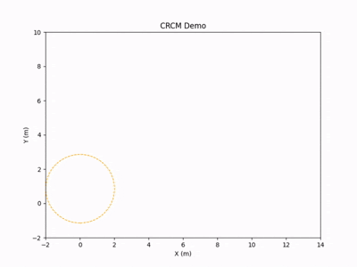
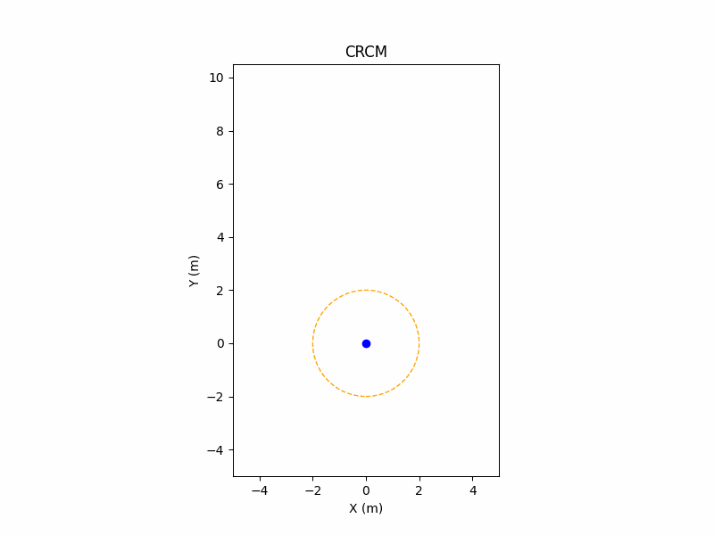
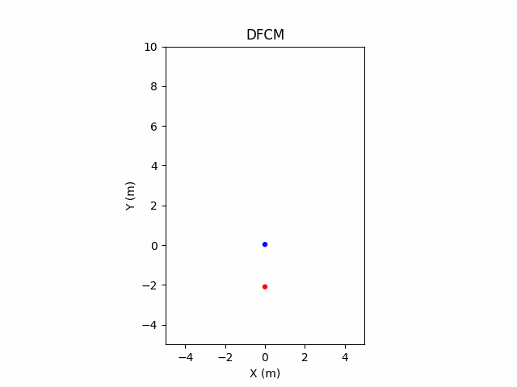

# CRCM
 Only the code for the key module CRCM is available at this stage of the study, and the complete project code will be considered for addition after the paper is published.
# A Following Collaborative Robot Harvesting-Assisted Transport System with Collaborative Region Constraints Model  

## Table of Contents

- [Introduction](#introduction)
- [Installation](#installation)
- [Usage](#usage)
- [Contributing](#contributing)
- [License](#license)
- [Contact](#contact)

## Introduction
Manual fruit harvesting remains essential in modern horticulture for its ability to preserve fruit quality and reduce mechanical damage. However, the increasing labour intensity of these operations highlights the need for efficient assistive technologies to sustain productivity and ensure sustainability. Although fully automated systems offer alternatives, their limited adaptability in unstructured environments and high implementation costs restrict large-scale deployment. To address these limitations, a following collaborative robot harvesting-assisted transport system (FCR-HATS) is developed, incorporating a novel collaborative region constrained model (CRCM) to enhance harvesting efficiency and reduce manual workload through human–robot collaboration. CRCM introduces a decision-making framework that transitions the robot's behaviour from conventional passive following to adaptive cooperation by enabling three execution modes: following, stopping, and monitoring. CRCM overcomes the trajectory deviations inherent in traditional direction-following constraint models (DFCM) by applying collaborative region constraints, allowing the FCR to better align with the human trajectory. Field experiments demonstrate that CRCM significantly enhances human-robot trajectory overlap accuracy, reduces the average matching cost (AMC) by 0.19, and mitigates collision risks without requiring additional obstacle avoidance strategies. With a unit shrinkage distance of 0.05m, the FCR achieves precise stopping with lateral and longitudinal errors of 0.17 m and 0.15 m, respectively. Validation in a greenhouse peach orchard further confirms the robustness and continuous operational capability of the proposed system under real harvesting conditions. 
### CRCM Demo

Here is a demo of how the project works:



This gif demonstrates the core functionality of CRCM：FTP generation module、Precise stopping module with collaborative region shrinkage、and Monitoring and re-following module.

Our CRCM VS Traditional DFCM:

<table>
  <tr>
    <td></td>
    <td></td>
  </tr>
</table>


## Installation

### Prerequisites

List any software or tools required to run the project.

- Python >= 3.9
- numpy >= 1.26.4
- pandas >= 2.2.3

### Installation Steps

1. Clone the repository:
   ```bash
   git clone https://github.com/xiaowangzi6668/CRCM.git
